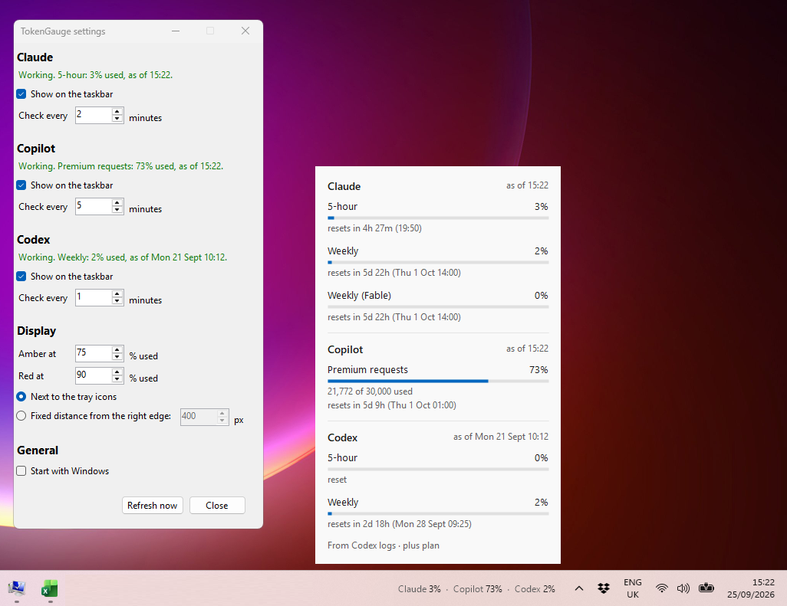

# TokenGauge

Shows your Claude, GitHub Copilot and Codex usage limits on the Windows 11 taskbar, next to the tray.



## Install

Download `TokenGauge.exe` from the [latest release](https://github.com/ryerac/Token-Gauge/releases/latest), or [build it yourself](#build). It's a single self-contained file for Windows 11; no installer or .NET needed.

1. Put it somewhere permanent, such as `C:\Tools\TokenGauge\`, rather than Downloads. Start with Windows runs it from wherever it is.
2. The exe isn't code-signed, so Windows may block it. Either right-click it → **Properties** → tick **Unblock** → **OK**, or run `Unblock-File C:\Tools\TokenGauge\TokenGauge.exe` in PowerShell. If SmartScreen still says "Windows protected your PC", click **More info** → **Run anyway**.
3. Run it. The first time, Settings opens so you can set up tools and tick **Start with Windows**.

If you move the exe later, run it once from the new location and Start with Windows follows it.

Each tool appears once it's set up:

- **Claude:** signed in to Claude Code.
- **Copilot:** the [GitHub CLI](https://cli.github.com/), signed in. Settings can install it and sign in for you.
- **Codex:** used at least once (CLI or VS Code extension).

You don't need all three. Tools you don't use simply don't appear, so if you only use Copilot, the taskbar just shows Copilot. You can also hide a tool in Settings.

## Use

Each figure is the limit closest to running out. By default it turns amber at 75% and red at 90%, and `?` means the last check failed so you're seeing the previous reading.

- **Left-click:** every limit, with reset times.
- **Right-click:** Refresh now, Settings, Exit. Running `TokenGauge.exe` again also opens Settings.

Settings apply immediately and are saved to `%APPDATA%\TokenGauge\settings.json`. They cover, per tool: show or hide, check interval (defaults: Claude and Copilot 5 min, Codex 1) and setup buttons. Also the colour thresholds, position and Start with Windows.

## How it works

| Tool | Source | Login |
| --- | --- | --- |
| Claude | `api.anthropic.com/api/oauth/usage`, the endpoint behind Claude Code's `/usage` | Claude Code's, from `~/.claude/.credentials.json` (only the `claudeAiOauth` section) |
| Copilot | `api.github.com/copilot_internal/user`, the endpoint VS Code uses | GitHub CLI's, via `gh auth token` |
| Codex | Latest `rate_limits` entry in `~/.codex/sessions` | None: local files only |

Logins are read, never refreshed or stored, and only sent to the service they belong to. If Claude Code's login expires, Claude shows its last reading until you next use Claude Code.

Codex figures come from the logs Codex writes on this PC, so they only update when you use Codex here. Usage on another machine or in the browser won't show until your next Codex request on this PC. The details popup shows when the figures were last updated.

TokenGauge is unofficial and not affiliated with Anthropic, GitHub or OpenAI. Both endpoints are undocumented and may change; each tool has its own reader in [src/Providers](src/Providers), so a change only breaks that one.

## Build

Requires the .NET 10 SDK.

```powershell
dotnet build src -c Release
.\src\bin\Release\net10.0-windows\TokenGauge.exe
```

See [docs/releasing.md](docs/releasing.md) for the single-file build, CI and publishing a release.

## License

[MIT](LICENSE)
